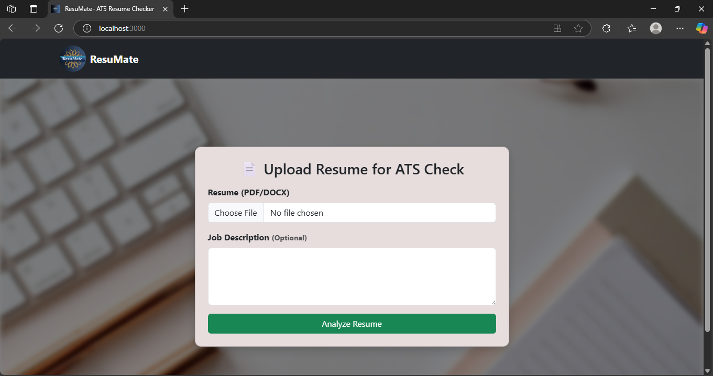
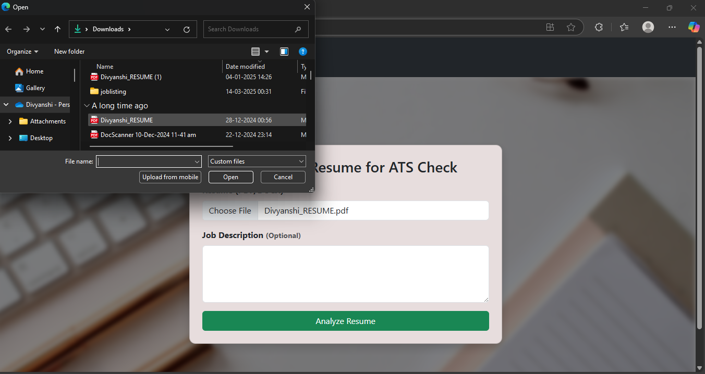
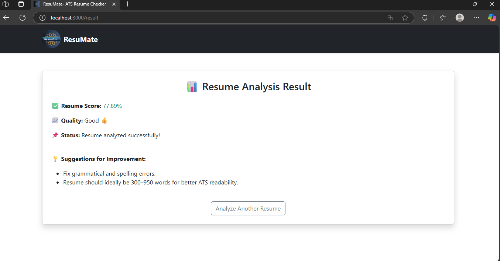
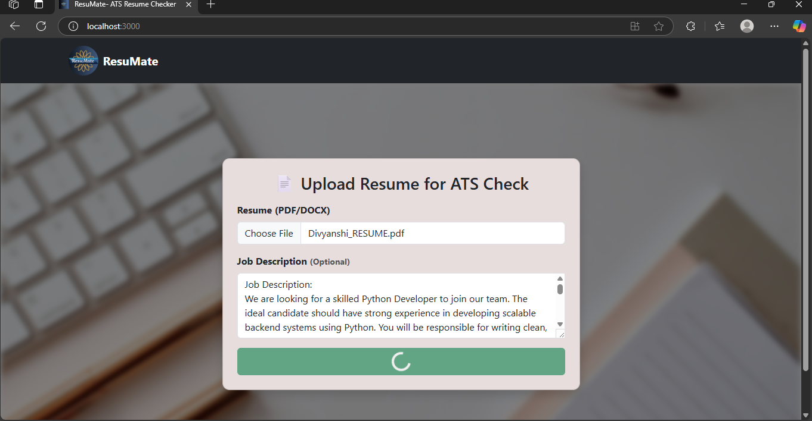
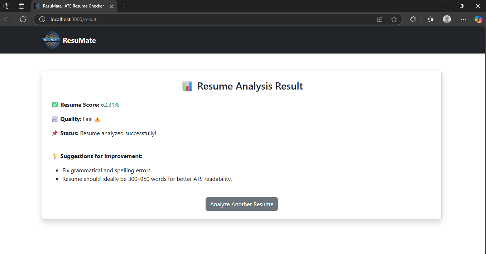

# 📄 ResuMate – ATS Resume Checker

ResuMate is a web-based application that helps job seekers optimize their resumes for Applicant Tracking Systems (ATS). By analyzing key sections, keyword presence, and formatting, ResuMate provides a score along with actionable suggestions to improve resume quality. An optional job description input allows for comparing and matching a resume against specific job requirements.

---

## 🚀 Features

- **Resume Upload**: Supports PDF and DOCX formats.
- **ATS Scoring**: Evaluates resumes on multiple criteria including sections, contact info, quantifiable metrics, grammar, and length.
- **Job Description Matching**: Compares the resume to an optional job description via TF-IDF and cosine similarity.
- **Actionable Feedback**: Provides suggestions to improve resume quality.
- **Responsive UI**: Built with React.js for a modern and user-friendly experience.
- **Backend API**: Powered by Django REST Framework to handle file processing and scoring.

---

## 🛠️ Tech Stack

- **Frontend**: React.js, Axios, Bootstrap
- **Backend**: Django, Django REST Framework
- **Natural Language Processing (NLP)**: NLTK, spaCy (for optional extensions)
- **Machine Learning / Similarity**: scikit-learn's TF-IDF and cosine similarity
- **Grammar Check**: LanguageTool Public API (subject to rate limits)

---


## 📄 Key Module: `resumate_scorer.py`

This file implements the core analysis for evaluating resume quality. Key functions include:

- **`clean_text`**: Normalizes text by removing unwanted characters, lowercasing, and filtering out stopwords (with exceptions for meaningful modifiers).
- **`check_resume_sections`**: Verifies if core sections like *skills, experience, education,* and *projects* are present and adds bonus points for additional sections like *certifications* and *awards*.
- **`check_contact_info`**: Searches for email and LinkedIn details, providing a high score if both are present.
- **`check_metrics`**: Identifies quantifiable achievements (e.g., percentages, monetary figures) and assigns up to 100 points.
- **`check_grammar`**: Leverages the LanguageTool Public API to detect grammatical and spelling errors and applies a penalty accordingly.
- **`check_length`**: Ensures the resume falls within an ideal word count (300–950 words).
- **`jd_match_score`**: Computes similarity between the resume and a job description using TF-IDF and cosine similarity.
- **`compute_resume_score`**: Aggregates the above evaluations with weighted scores and provides an overall score, quality label, detailed breakdown, and improvement suggestions.

---

## ⚙️ How to Run Locally

### Backend Setup

1. **Clone the Repository:**

   ```bash
   git clone https://github.com/your-username/Resumate-Project1.git
   cd resumate

2. **Setup and Activate Python Virtual Environment:**

  ```bash
  cd backend
  python -m venv venv
  # On Windows:
  venv\Scripts\activate
  # On macOS/Linux:
  source venv/bin/activate
```

3. Install Dependencies:


### Start the web app
A. Run the Django Server:  (in one terminal)

```bash
cd resumate-backend
python manage.py runserver
```

B. Start the React App: (in another terminal)

```bash
cd resumate-frontend
npm start
```

The frontend runs on http://localhost:3000 and communicates with the backend at http://127.0.0.1:8000.

## Screenshots:
1. Home Page


2. Resume upload


3. Result Page


4. Job description input


5. JD based Score



